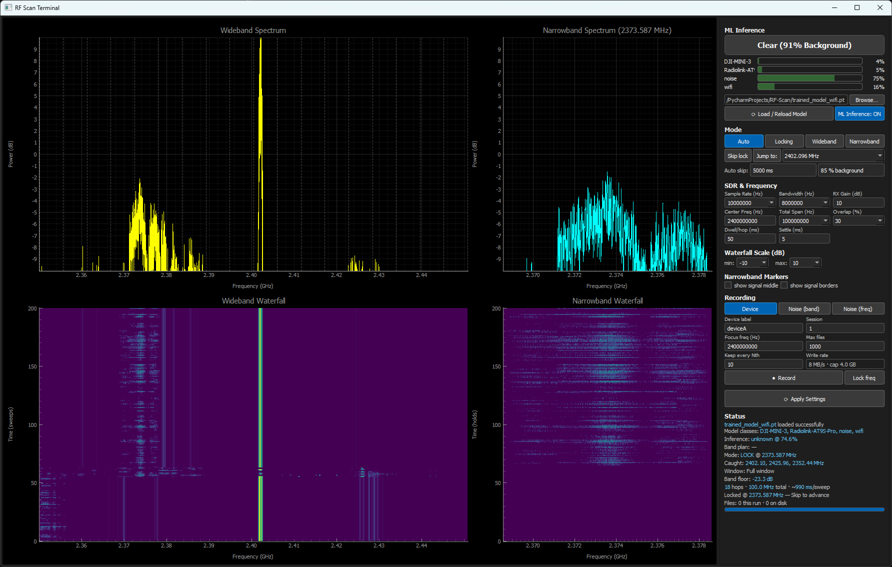

# RF Scan

RF Scan is a signal monitor for the PlutoSDR.
It sweeps a radio band, it holds each signal that goes above the noise floor, and a small CNN reads the raw IQ data and gives the transmitter a name.
The same program records the training data, thus the record path and the detect path always prepare the data in the same way

## Features

- Four modes. Wideband sweeps the span, Narrowband holds one frequency, Locking holds each new signal until you release it, and Auto releases the lock itself when the classifier calls the signal background.
- A spectrum and a waterfall for the full band, and a second pair for the held frequency. A peak hold keeps a short burst at its true amplitude, and markers give the middle and the two edges of the held signal.
- Record raw IQ frames. A device, the noise of the band, and the noise at the frequency of the device, each with a metadata file and a session number.
- Train a model from those captures. One full session stays out of the training data, and the run reports a confusion matrix and a weak-signal accuracy.
- Load a model and read the names live. The badge names the transmitter of each held signal, and another model loads without a restart of the sweep.
- Change every value in the window: the sample rate, the bandwidth, the RX gain, the centre frequency, the span, the overlap, the dwell time, the settle time, the scale of the waterfalls, the two limits of the Auto mode, and the rate and the limit of the recorder.

## Installation

Install the PlutoSDR drivers of your operating system, then the Python libraries. The program needs Python 3.10 or a later version.

```bash
pip install -r requirements.txt
```

The program connects to `ip:192.168.2.1`, which is the factory address. For another address, or for USB, set the environment variable `PLUTO_URI`.

```bash
set PLUTO_URI=ip:192.168.3.1
```

## Usage



Start the interface from the directory of the project, because the program writes to `./fingerprint_data/`.

```bash
python terminal.py
```

1. Set the center frequency, the span and the gain, then click **Apply Settings**. The default sweep covers 2350 to 2450 MHz in 15 hops, in about 1.5 s.
2. Select a mode. The program sweeps, and it holds each new signal above the threshold.
3. Read the badge for the name of the device, the bars for the probability of each class, and the **Status** section for the band plan, the window and the warnings.
4. Click **Skip lock** to release a lock yourself.

| Mode       | Function                                                                                                                |
|------------|-------------------------------------------------------------------------------------------------------------------------|
| Auto       | Sweep, hold each new signal, and release the lock when the classifier calls the signal background. This is the default. |
| Locking    | The same, but the lock continues until you click **Skip lock**.                                                         |
| Wideband   | The sweep alone. There is no lock.                                                                                      |
| Narrowband | One frequency alone. Use this mode for a device record.                                                                 |

The project has five commands. The first is the program and the other four report on it.

| Command                        | Function                                                                                        |
|--------------------------------|-------------------------------------------------------------------------------------------------|
| `python terminal.py`           | The monitor: sweep, lock, classify and record.                                                  |
| `python train_model.py`        | The trainer: a folder of captures to a model.                                                   |
| `python tools/dataset_info.py` | What the dataset holds, and each warning that decides whether a training run can mean anything. |
| `python tools/evaluate.py`     | What a model does to whole captures, which is the level that the user sees.                     |
| `python tools/eval_clip.py`    | What a model says about a clip that was never on the air.                                       |

### Recording

The classifier learns from your recordings only. Each kind of record writes to a different class folder.

| Kind         | Mode       | Folder            | Condition                                                           |
|--------------|------------|-------------------|---------------------------------------------------------------------|
| Device       | Narrowband | `<device label>/` | The device transmits.                                               |
| Noise (band) | Wideband   | `noise/`          | All the devices are off.                                            |
| Noise (freq) | Narrowband | `noise/`          | The radio is on the frequency of the device, and the device is off. |

Noise (freq) is the most important kind.
Without it the classifier learns that all the energy at that frequency is a drone, and not the fingerprint of the drone.

Record the three kinds, then do it again with a new session number and the antenna in another place.
Two sessions are the minimum, because the trainer holds one full session out. Then verify the data before you train.

```bash
python tools/dataset_info.py
```

The tool counts each class and each session, and it gives a warning for each condition that makes a training run useless: a class with one session, no `noise` class, mixed RXgains, a capture with no `.json` file, or one device class only.

The drone classes of this project come from the [RFUAV](https://github.com/kitoweeknd/RFUAV) dataset, which a USRP B210 replays and the PlutoSDR receives. Give each clip to `transmitting/prepare_clip.py` first, because a file source in GNU Radio sends a clip of 100 Msps at the rate of the sink, and nothing reports that the signal is now 10 times too slow and 10 times too narrow.

### Training

```bash
python train_model.py --preset balanced --out trained_model.pt
```

Each top-level folder in `fingerprint_data/` is one class.
The trainer makes the spectrograms, it trains `SpecCNN` (a 2-D CNN of approximately 60 000 parameters), and it writes the weights, a `.meta.json` with the geometry and the classes, and the metrics of the run in `results/`.

| Preset     | Epochs | Files for each class | Segments for each file | Channels |
|------------|--------|----------------------|------------------------|----------|
| `fast`     | 5      | 15                   | 40                     | 16       |
| `balanced` | 8      | 5000                 | 150                    | 16       |
| `best`     | 30     | all                  | all                    | 24       |

The preset `fast` is a check of the procedure. Its accuracy is not the result of the project.

The trainer changes your data again at each epoch: an energy gate removes the quiet device segments, one half of them goes into real recorded noise at 0 to 20 dB, a random shift moves the signal in frequency, and a mask hides a frequency band and a time stripe of each image.
Thus, the network learns the fingerprint, and not the position or the level.

Read the weak-signal val value and not ValAcc, because ValAcc covers the strong recordings only.

### The model in the program

The interface loads `trained_model.pt` and its `.meta.json` at the start.
Click **Browse…** and **Load / Reload Model** for another model, with no restart.
**ML Inference: ON** sets the classifier to off.

| Badge                          | Meaning                                                                                                                     |
|--------------------------------|-----------------------------------------------------------------------------------------------------------------------------|
| `Clear (82% Background)`       | There is no device. The percentage is every background class together.                                                      |
| `deviceA (93%)`                | The named device transmits.                                                                                                 |
| `deviceA (29%)`                | The votes of the segments name the device, though the mean of the capture is below the limit. A bursty link reads this way. |
| `Unknown Device (71%)`         | A device transmits, but no class has a sufficient probability.                                                              |
| `deviceA (50%) + droneB (40%)` | The votes of the segments found two transmitters in one capture.                                                            |

## Validation

```bash
python tests/run_all.py
```

242 self-checks in 11 scripts, which also run on each push. They need numpy and torch only, thus no check needs a PlutoSDR.
A full run takes 1 to 2 minutes, and `--fast`leaves approximately 33 s.
A `defect #N` line is not a failure: it is a known defect, and it becomes `FIXED #N` the moment a correction operates.

The end-to-end check is the most important one. 
It builds a dataset of two synthetic drones, it starts the real trainer, and it gives the result to the same wrapper that the interface loads.

The trainer counts segments and the program shows one badge for a whole capture, thus measure the model at the level that the user sees.

```bash
python tools/evaluate.py trained_model.pt
```

The tool calls `badge_for` from `terminal.py` and holds no second copy of the rule, thus the report and the program cannot disagree. `tools/eval_clip.py` asks the model about a prepared clip that was never on the air, at a stated signal-to-noise ratio.

A validation session chooses the model, thus its accuracy is not a result that a report may quote.
Move the last session of each class out, read it one time with `--data_dir ./heldout_data`, and change nothing after you read it.

A false alarm rate from your `noise` captures is the rate of that room.
This model gave 0.4% on 500 held-out `noise` captures of a quiet room, and 24% on 100 live captures in a room with WiFi and no drone.
A class that the model never met becomes the class that it most resembles, thus record WiFi and Bluetooth as classes of their own.

### Measuring your radio

`measurements/` holds the programs that measure the PlutoSDR itself, and the results that my own radio gave.
Nothing there is part of the application. For your own radio: capture with a 50 ohm load, capture again with an antenna, and `pick_w.py` then gives your value of `DC_HP_WIN` for `fp_spectrogram.py`.
The part that disappears with the load is your room, and the part that stays belongs to your radio.

## Limitations

- The PlutoSDR receives 20 MHz at the maximum, and 3.8 GHz at the highest. The hops of a wider sweep are not simultaneous, thus a burst in another hop is lost.
- The receiver is zero-IF. The high pass that removes its artifact at 0 Hz also removes a carrier that sits exactly on the tuned frequency.
- The classifier knows your classes only. An unknown transmitter becomes`Unknown Device`, or the class that it most resembles.
- Every class of this project left one USRP B210, and the program does not keep the phase. Thus it names the type of the drone, and not one individual unit.
- The votes of the segments separate two transmitters in time only. Two signals in one segment stay together.
- A signal below 18 dB of signal-to-noise ratio does not cause a lock.
- The monitor is a graphical program. There is no command-line interface for it.

## License

This project is licensed under the MIT License.
Copyright © 2026 Nojus Balčiūnas
