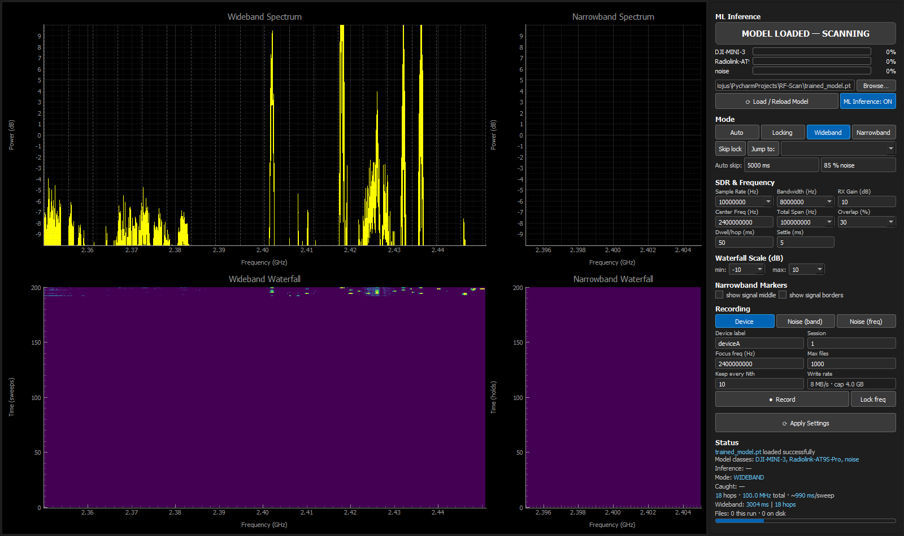
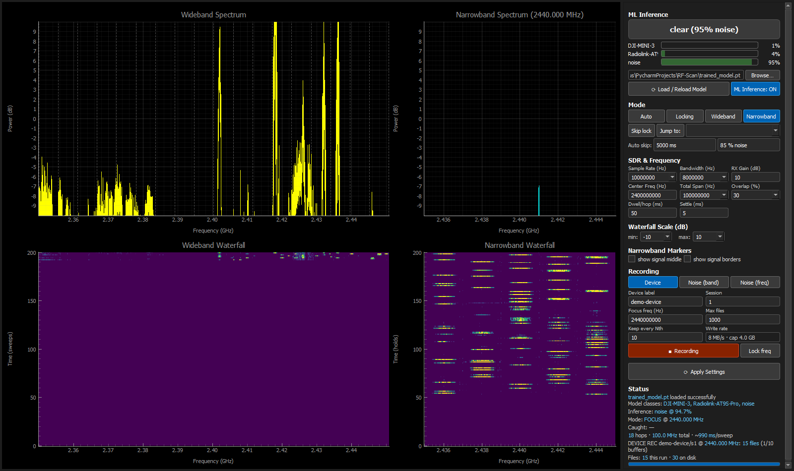
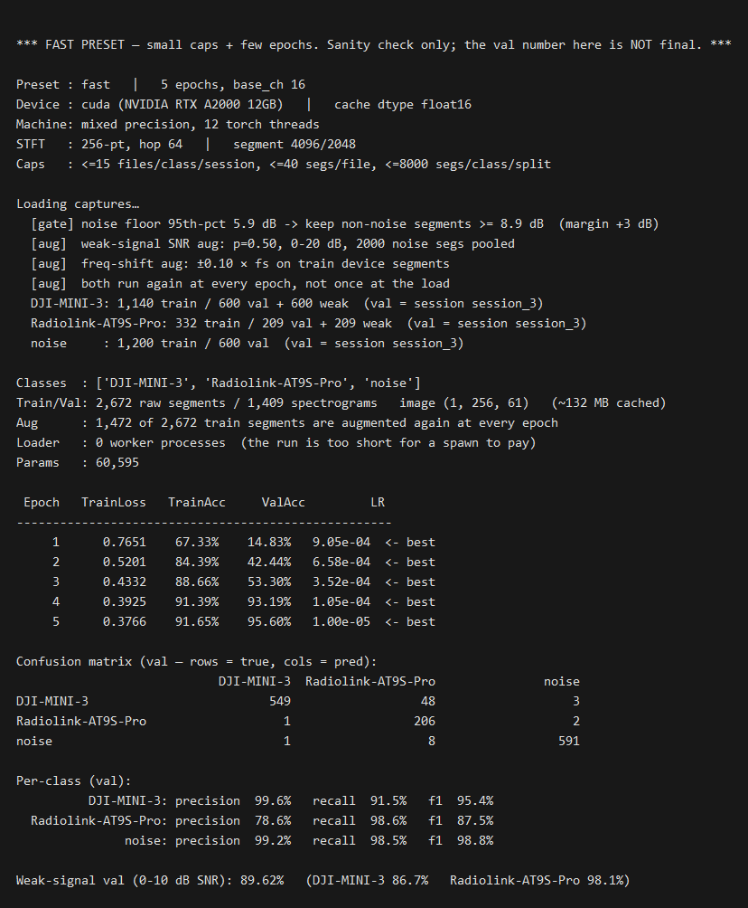

# RF Scan

RF Scan is a signal monitor for the PlutoSDR. It finds the devices that transmit in a
radio band, and it gives each device a name.

The program sweeps a band. When a signal goes above the noise floor, the program tunes
to that frequency and holds it. A small neural network then reads the raw IQ data of
the signal and identifies the transmitter. The same program also records the training
data. Thus the record function and the detect function always prepare the data in the
same way.

The first application is the 2.4 GHz band. The program separates a drone control link
or a drone video link from WiFi, from Bluetooth and from the background noise.

## Features

### The signal chain

The program has one signal chain. Each step gives its result to the next step.

| Step | Operation |
|---|---|
| 1. Sweep | The program divides the span into hops. It tunes to each hop, it waits for the settle time, and it reads one buffer. |
| 2. Spectrum | For each hop the program calculates 1024-bin FFTs across the full buffer. It removes the mean of each window first, thus the artifact of the receiver at 0 Hz does not become a false peak. It keeps the maximum value of each bin, thus a short burst stays visible. |
| 3. Composite | The program keeps the central bins of each hop and joins the parts end to end. One linear map gives the frequency of each bin. |
| 4. Peak | The program finds the strongest peak that is not in the memory of the caught signals. A peak above the threshold causes a lock. |
| 5. Lock | The radio holds that one frequency. The frequency does not move during the hold. |
| 6. Segments | The program cuts the held IQ data into segments of 4096 samples, with a step of 2048 samples. |
| 7. Spectrogram | A high pass removes the artifact of the receiver near 0 Hz. Each segment then becomes a 256-point STFT image of the log magnitude. The program replaces the 0 Hz row with the median row, thus no class can be recognized by that row. The program normalizes each image with its own mean and standard deviation, thus the result does not change with the gain. |
| 8. Classifier | A CNN gives a probability for each class and for each segment. The program calculates the mean, and it also counts the votes of the segments. |
| 9. Result | The badge shows the name of the device, or `clear`, or two names. |

The program releases the lock in three conditions: the user clicks **Skip lock**, the
signal stops for 2.5 s, or the Auto mode finds that the signal is noise. Then the
frequency goes into the memory of the caught signals for 30 s. Thus the scanner moves
through all the signals in the band, and it does not hold the strongest signal only.
An entry in the memory expires. Thus the program can find that signal again.

### The monitor

- Four modes: Auto, Locking, Wideband and Narrowband.
- Four live plots: a wideband spectrum with a waterfall, and a narrowband spectrum
  with a waterfall.
- A sweep with a configurable center, span, overlap, dwell time and settle time. The
  plot shows a line at each hop boundary.
- A peak-hold spectrum. Thus a short burst is visible at its true amplitude.
- A lock state machine with a caught list, a time-out, a Skip button and a Jump-to
  button.
- Markers for the middle and the two edges of the narrowband signal. The program
  measures the markers from the spectrum only.
- Manual gain. The program sets the automatic gain control to off, because a constant
  level is necessary for the fingerprints.

### The classifier

- A CNN that identifies the transmitter from the raw IQ data.
- A probability bar for each class.
- A limit on the rate of the classifier. Thus the plots stay fast.
- A switch that sets the classifier to off.
- A report of two or more transmitters in one capture, through the votes of the
  segments.
- The Auto mode releases a lock that the classifier calls noise.
- The program loads a new model without a restart.

### The recorder

- Three kinds of record: a device, the noise of the full band, and the noise at the
  frequency of the device.
- A JSON metadata file next to each capture.
- A limit on the number of files.
- The Record button starts the mode that gives the correct data.

### The replay

- `transmitting/prepare_clip.py` takes one slice of an RFUAV clip, moves it to the
  baseband, and gives it at the rate of the replay. A clip of 100 Msps that goes to a
  transmitter at 10 Msps is 10 times too slow and 10 times too narrow, and nothing in
  GNU Radio reports that.
- The same level in every class, thus the TX gain controls the signal-to-noise ratio
  and it is not a second variable.
- A `.json` beside each clip, which holds every value that the extraction used.
- `transmitting/gnuradio/iqRepeat.grc`, the flow graph that replays a clip through a
  USRP B210.

### The trainer

- Three presets: fast, balanced and best.
- A split that holds one full session out of the training data.
- An energy gate that removes the quiet segments from the device classes.
- Three augmentations: a signal-to-noise mix, a frequency shift and a spectrogram
  mask.
- A confusion matrix, and the precision, the recall and the F1 value of each class.
- An accuracy value for a weak signal.

## Installation

The program needs Python 3.10 or a later version.

```bash
pip install -r requirements.txt
```

This command installs numpy, torch, pyqtgraph, PyQt5 and pyadi-iio. The package
pyadi-iio needs the libiio library of Analog Devices. Install the PlutoSDR drivers of
your operating system first.

The program connects to `ip:192.168.2.1`. This address is the factory address of the
PlutoSDR. If your radio has a different address, set the environment variable
`PLUTO_URI`.

```bash
set PLUTO_URI=ip:192.168.3.1
```

A USB address also operates. The command `iio_info -s` gives the address of each radio
that is connected.

```bash
set PLUTO_URI=usb:1.5.5
```

## Usage

Start the graphical interface from the directory of the project:

```bash
python terminal.py
```

The program writes the recordings to `./fingerprint_data/`. This path is relative to
the current directory. Thus you must start the program from the directory of the
project.

The panel on the right side has four mode buttons:

| Mode | Function |
|---|---|
| Auto | The program sweeps, it locks each new signal, and it releases the lock automatically if the classifier calls the signal noise. This is the default mode. |
| Locking | The same operation, but the lock continues until you click **Skip lock**. |
| Wideband | The program sweeps the band only. There is no lock. |
| Narrowband | The radio holds one frequency only. Use this mode for a device record. |

The button **⟳ Apply Settings** sends the values of the SDR panel to the radio and
starts the sweep again. A change of the mode or of the settings stops a record.

## Viewing the program

The window shows four plots.

- **Wideband Spectrum** - the composite of the full sweep. The dashed grey lines show
  the hop boundaries. During a lock, the program puts the live narrowband spectrum
  into the composite. Thus the full band stays visible.
- **Wideband Waterfall** - the last 200 sweeps. The time axis goes up.
- **Narrowband Spectrum** - the spectrum of the held frequency. The two check boxes in
  the **Narrowband Markers** section put a red line at the middle of the signal, and
  two dashed red lines at the edges. The program calculates the edges at the point
  where the signal goes 3 dB above the noise floor. The middle is the center of the
  power between the two edges, and not the highest bin. Thus the marker is stable.
- **Narrowband Waterfall** - the last 200 held captures.

The section **Waterfall Scale (dB)** sets the minimum and the maximum of the color
scale of both waterfalls.

The **Status** section shows the model, the last result of the classifier, the mode,
the caught frequencies, the number of hops and the time of one sweep.

## Recording

The classifier learns from your recordings only. The section **Recording** has three
kinds of record. Each kind writes to a different class folder.

| Kind | Mode | Folder | Condition |
|---|---|---|---|
| Device | Narrowband | `<device label>/` | The device transmits. |
| Noise (band) | Wideband | `noise/` | All the devices are off. |
| Noise (freq) | Narrowband | `noise/` | The radio is on the frequency of the device. The device is off. |

The kind Noise (freq) is the most important kind. Without this data the classifier
learns that all the energy at that frequency is a drone. It does not learn the
fingerprint of the drone.

Set the **Device label**, the **Session** number and the **Focus freq**. Then click
**● Record**. The program starts the correct mode automatically. The button **Lock
freq** copies the frequency of the last lock into the Focus freq field.

The Narrowband mode reads one buffer for each dwell time. At the default settings that
is 4 MB every 50 ms, which is 80 MB each second. The field **Keep every Nth** saves 1
buffer of N. The default value is 10. The same quantity of files then covers 10 times
more time, and it gives more different data. The field **Write rate** shows the rate
and the total size of the limit **Max files**. Both values change while you type.

The counter at the bottom gives two numbers. The first is the number of files that
this run wrote. The second is the number of `.iq` files in `fingerprint_data/`. The
limit **Max files** removes the oldest file of the current run only. It never removes
a file of an earlier session, thus a long series of sessions can use more space than
the limit. The counter gives a warning in that condition.

### Verify the data before you train

```bash
python dataset_info.py
```

This command gives the number of files, segments, seconds and bytes of each class and
each session, the frequency of each class, and a warning for each condition that makes
a training run useless.

| Warning | Why it is important |
|---|---|
| A class has 1 session | The trainer uses a random split, and that accuracy has no meaning. |
| There is no `noise` class | The energy gate and the Auto mode both need it. |
| The dataset mixes RX gains | The energy gate compares raw dB, thus a gain change makes the limit false. |
| A capture has no `.json` file | The tool can not give the duration or the gain of that capture. |
| There is less than 1 device class | Two drones are necessary for the goal. |

Use this command after each recording session. A gain that is not the same in each
session is the error that is the most difficult to see later.

The files go to this structure:

```
fingerprint_data/
  deviceA/
    session_1/
      deviceA_s1_1712345678901.iq      raw complex64, little-endian
      deviceA_s1_1712345678901.json    the metadata
  noise/
    session_1/
```

The name of the top-level folder is the name of the class. The trainer reads the name
of the folder only. It does not read the JSON file.

### The full procedure for the data collection

1. Set all the devices to off. Record in the Noise (band) mode.
2. Tune to the frequency of the drone. Keep the drone off. Record in the Noise (freq)
   mode.
3. Set the drone to on. Make sure that the drone transmits. Record in the Device mode.
4. Do the steps 1 to 3 again with a new session number. Move the antenna between the
   sessions. Two sessions are the minimum. Three sessions are better.

The step 4 is necessary. The trainer holds one full session out of the training data.
With one session only, the accuracy value has no meaning.

### How the drone classes of this project are recorded

The drone classes here do not come from a drone in flight. They come from the RFUAV
dataset, which a **USRP B210** replays and the PlutoSDR receives.

RFUAV is a benchmark dataset of raw RF recordings of 35 drone types, made with USRP
equipment and stored as float32 raw IQ. Its authors document it for replay.

- Source: `https://github.com/kitoweeknd/RFUAV`
- Licence: Apache 2.0. Give the attribution if you use it.

The method:

1. Choose the drone types, and divide the clips of each type into a set for the
   training and a set for the test **before any recording**. The two sets never hold
   the same clip. A held-out session of the same clip is the same signal with other
   noise, thus it proves nothing.
2. Extract one slice of the source band with `prepare_clip.py`, because the source is
   at 100 Msps, the B210 gives 61.44 Msps at the maximum and this program receives
   10 Msps in an 8 MHz filter. **Do not give the source file to GNU Radio.** See the
   section below.
3. Connect the B210 TX to the PlutoSDR RX with a cable and a fixed attenuator. A
   conducted path repeats, it makes the signal-to-noise ratio a setting and not an
   estimate, and it keeps the WiFi and the Bluetooth of the building out of the
   captures.
4. Record each drone type from the training clips, at three or more TX gains. The TX
   gain gives the signal-to-noise ratio directly, thus the accuracy for a weak signal
   is a measured value.
5. Record the class `noise` with the B210 **on and transmitting zeros**, at the same
   centre frequency and the same gain. A `noise` class recorded with the transmitter
   off teaches the model to answer the question "is the USRP on".
6. Keep the TX centre frequency the same for every class, and put the frequency of
   each drone in the baseband. A centre frequency that follows the class is a perfect
   cue for the classifier.
7. Record the classes `wifi` and `bluetooth` separately, with a real antenna and with
   the B210 off.
8. Record the test set from the test clips only. Do not train on it and do not use it
   to choose a threshold.

One consequence to state in a report: each class leaves the same B210, thus the
hardware signature of the transmitter is identical in all of them. The model
identifies the **type of the drone** from the waveform. It does not identify one
individual unit.

### Prepare a clip for the replay

```bash
python transmitting/prepare_clip.py "pack1_1-2s.iq" --offset-hz 5e6
```

A file source in GNU Radio does not know the rate of its file. It sends the samples at
the rate that the sink takes. Thus a clip of 100 Msps that goes to a transmitter at
10 Msps is 10 times too slow in time and 10 times too narrow in frequency. The replay
runs, the waterfall looks correct, and the signal is not the drone. Nothing reports it.

`prepare_clip.py` takes one slice of the source band, moves it to the baseband, and
writes a file at the rate of the replay. It also puts the clip at a chosen level.

The program lives in `transmitting/`, with the flow graph that replays its output in
`transmitting/gnuradio/`. The output goes to `transmitting/clips/`, and the name of
the source gives the name of
the clip. That directory is the one of the program and not the current directory, thus
the command gives the same answer from any place. Give a second path to choose the
output yourself.

| Why each part is there | |
| --- | --- |
| The slice | A control link hops across the whole band. One 10 MHz window holds a part of the hops and not all of them. Say which part in the report. |
| The level | The clips of one dataset are not at the same level, and a difference of level between two classes is a class cue. The same level in every class makes the TX gain a control of the signal-to-noise ratio and not a second variable. |
| The `.json` | It holds the rate, the offset, the filter, the level before and after, and the scale. Thus the extraction can be repeated and it can go in a report. |
| The signal test | A hopping link puts nothing in one slice for a whole second. The level step would then raise that noise to the target and write a clip that holds no drone under the name of one. The program refuses instead. |

The signal test measures the strongest bin of the slice above the median bin of the
whole source band. The source is 100 MHz and the greater part of it is empty, thus its
median is the noise of the recording. An empty slice gives 4 to 7 dB, a hopping control
link gives 15 to 23 dB, and a video link gives 39 to 43 dB. The limit is 15 dB and
`--min-signal-db 0` removes it.

The reference must come from outside the slice. A test that takes it from inside fails
twice: a measure of burstiness refuses a carrier that never stops, and a peak against
the median of the slice refuses a signal that fills the slice.

Leave the packs where they are. The program reads any path, thus a pack does not go in
the repository. One second of a source is 800 MB.

The program reads the `.xml` of the RFUAV pack if it is beside the clip. The `.xml`
gives the true sample rate and centre frequency, and it has precedence over the flags.

Two traps that the layout of RFUAV makes:

- **`--offset-hz` is from the middle of that pack, and each pack has its own middle.**
  The Radiolink pack is at 2440 MHz and the DJI pack is at 2470 MHz, thus the same
  offset gives two different frequencies. Read `slice_center` in the `.json` to see
  where the slice really was.
- **Two packs hold files with the same name.** The default output name comes from the
  name of the source, thus `pack2_1-2s.iq` of one folder and `pack2_1-2s.iq` of
  another give one name. The program stops instead of writing over the first clip.
  Give a name that holds the class.

Use the **same** `--peak` for every class. Use one TX centre frequency for the whole
campaign, and let `--offset-hz` choose which part of the source band goes there.

### The flow graph of the replay

`transmitting/gnuradio/iqRepeat.grc` holds it. Open it in GNU Radio Companion, put the
path of a prepared clip in the file source, and generate. `transmitting/clips/` is where the
prepared clips go, and it is not in git: one second is 80 MB, and the `.json` beside
each clip is enough to make it again.

Three rules, and the flow graph follows all three:

1. **No throttle block.** The USRP sink gives the rate of the flow graph. A throttle
   keeps its own time against the clock of the computer, thus the two move apart and
   the transmitter has an underrun. Use a throttle only when no hardware block is in
   the flow graph.
2. **The TX gain is a fixed value, not a slider.** The gain sets the signal-to-noise
   ratio of the whole session, and nothing in the capture records it. Write the number
   in the session notes.
3. **A multiply block gives the `noise` class.** Set the constant to 0. The USRP stays
   on, at the same frequency and the same gain, and it sends zeros.

## Training ML

```bash
python train_model.py --preset balanced --out trained_model.pt
```

Each top-level folder in `fingerprint_data/` is one class. The trainer converts the
captures into spectrograms, it trains the network, and it writes three files.

| File | Content |
|---|---|
| `trained_model.pt` | The weights. |
| `trained_model.meta.json` | The geometry, the class names, the two limits, the sample rate of the captures, the git commit, the time and every argument. The graphical interface reads this file. |
| `trained_model.metrics.json` | The confusion matrix, the precision, the recall, the F1 value and the support of each class, and the weak-signal figures. Use this file for a report. |

### The model

The network is `SpecCNN`, a small 2-D CNN. It has four blocks. Each block has a 3x3
convolution, a batch normalization, a GELU activation and a max pool. The number of
channels is 16, 32, 64, 64 for the presets fast and balanced. Then an adaptive average
pool, a dropout and one linear layer give the classes. The model has approximately
60 000 parameters, or 135 000 parameters with the preset best. The program trains the
model from the start. There is no pretrained model. The input is one channel: the log
magnitude of a 256-point STFT. The program does not keep the phase.

### The presets

| Preset | Epochs | Files for each class | Segments for each file | Channels |
|---|---|---|---|---|
| `fast` | 5 | 15 | 40 | 16 |
| `balanced` | 8 | 5000 | 150 | 16 |
| `best` | 30 | all | all | 24 |

The preset `fast` is a check of the procedure only. Its accuracy value is not the final
value. A run without the flag `--preset` uses `balanced`, because the constant `PRESET`
at the top of the file gives that value.

### What the trainer does with your data

- The energy gate. A parked capture of a device is mostly silence between the bursts.
  These quiet segments have the label of the device, but they are noise. The gate
  removes each non-noise segment that is not 3 dB above the noise floor. The program
  calculates the floor from the train sessions of the noise class.
- The signal-to-noise augmentation. Your recordings are strong, because the antenna is
  near. A live signal is weak. The trainer puts one half of the train device segments
  into real recorded noise, at 0 to 20 dB.
- The frequency shift. Your recordings always put the device at the same spectrogram
  rows. Thus the network can learn the position and not the fingerprint. A random shift
  of ±10% of the sample rate prevents this.
- The spectrogram mask. The trainer hides a frequency band and a time stripe of each
  image. Thus the network learns from a part of the evidence. A WiFi burst above your
  drone does not stop the identification.

All three run again at each epoch, and each image gets its own values. The trainer
keeps the raw data of the train split and it makes the image at the moment of use. A
cache of images gives one version of each segment, and 30 epochs then see the same
picture 30 times. This costs approximately 320 us for each segment, which is 6 s for
each epoch at 20 000 segments. The val data and the weak-signal data do not change,
because a measurement must give the same result at each epoch.

### The other flags

Use `--epochs`, `--base_ch`, `--max_segs_per_class`, `--gate_margin_db`, `--snr_aug_p`
and `--freq_shift_frac` to change one value of the preset. A flag has precedence over
the preset. Use `--cpu` for the CPU, and `--store_dtype float32` for more precision in
the cache. The command `python train_model.py --help` gives the full list.

The default value of `--out` is `./trained_model.pt`, which is the name that the
graphical interface loads at the start. The trainer makes the directory of the output
if it does not exist.

Two limits control the names that the program gives. The flag `--unknown_thresh`
(0.8) is the probability of the mean of a full buffer that gives a name. The flag
`--vote_thresh` (0.5) is the probability of one 0.4 ms segment that gives a vote. The
second value is lower, because one segment holds much less evidence than a full
buffer. Both values go into the meta file, thus each model carries its own limits.

## Loading ML

The graphical interface loads `trained_model.pt` from the directory of the script at
the start. The file `trained_model.meta.json` must be in the same directory, with the
same name. The model reads the geometry from that file. Thus an old model continues to
operate after a change of the constants.

To load a different model, click **Browse…**, select the `.pt` file, and click
**⟳ Load / Reload Model**. The program loads the model without a restart of the sweep.
The button **ML Inference: ON** sets the classifier to off. Then the program only shows
the spectrum, and it operates much faster.

The badge above the buttons shows the result:

| Badge | Meaning |
|---|---|
| `clear (82% noise)` | There is no device. |
| `deviceA (93%)` | The named device transmits. The limit is 60%. |
| `unknown device (71%)` | A device transmits, but no single class has a sufficient probability. |
| `deviceA 50% + droneB 40%` | The votes of the segments found two transmitters in one capture. A segment votes at 50%, and a class needs 20% of all the segments. |

The bar of each class shows the mean probability. The Auto mode releases a lock when
the probability of the class `noise` is 75% or more, after a dwell time of 5000 ms.
Both values are adjustable in the **Mode** section. The Auto mode needs a class with
the name `noise`. Without that class the program does not release a lock automatically,
and the panel gives a warning at the load of the model.

## Example

The images are placeholders. Replace them with screen captures of your system. They
live in `docs/`, which holds the images of this file and nothing else. Keep the file
names, because the links below use them. Use PNG, and capture the window alone.

### The main window during a sweep

The wideband spectrum, the waterfall and the hop boundary lines.



### A lock on a drone control link, with the markers of the signal

The middle marker and the two occupied-bandwidth edges.


### The recording panel during a device record

The **Recording** panel, with the file count and the **Write rate** field.



### The output of the trainer with the confusion matrix

The terminal at the end of a run, with the confusion matrix and the per-class figures.



## Validation

### The self-checks

The project has 166 self-checks in 10 scripts. One command runs all of them. The same
command runs on each push, through `.github/workflows/tests.yml`.

```bash
python tests/run_all.py
```

The checks do not need a PlutoSDR. They do not need Qt and they do not need the libiio
library. They need numpy and torch only, because the support module replaces the three
driver packages if they are absent. A package that is installed has precedence, except
where a check asks for the replacement: `tests/test_worker.py` needs the false signal
and the false thread, which the real Qt does not give. Thus the result of the suite
does not change with the packages that your machine holds. A full run takes 1 to 2
minutes. The end-to-end check trains a small model, thus its time changes with the
load of your machine: measured between 32 s and 88 s on the same computer.

```bash
python tests/run_all.py --fast
```

The flag `--fast` removes the end-to-end check. The other checks take approximately
25 s and that time is stable. Use `--fast` while you work, and the full run before you
push. Each script also operates alone, and from any directory.

```bash
python tests/test_dsp.py
```

### What each script holds

| Script | Checks | Subject |
|---|---|---|
| `fp_spectrogram.py` | 1 | The function `segment_vote` must find two transmitters in one buffer, and it must give no name to a buffer with a low probability. |
| `tests/test_geometry.py` | 9 | The frequency of a tone must return through the map of the composite. The parts must join without a gap. The band must be the band that you asked for. |
| `tests/test_spectrogram.py` | 18 | The size of the image, the normalization, the frequency of each row, and the segment cutter. A gain of 60 dB must not move the image. The high pass must remove the artifact of the receiver and keep a signal that is near it, and the 0 Hz row of the image must carry nothing for any input. Three of the checks use an artifact that is calibrated against the PlutoSDR, because a constant offset is not what a radio makes. |
| `tests/test_dsp.py` | 30 | The peak hold must find a burst that is in 1 window of 100, and also a burst at the end of a long buffer. One window alone must miss it. The artifact of the receiver must not make a peak at the middle of a hop. The corrected noise floor must not change with the dwell time. The markers must give the correct middle and the correct edges of a signal of a known width. A hop that failed must not change the noise floor. The badge must give the correct name in each condition. |
| `tests/test_snr_aug.py` | 11 | The function `_mix_noise` must give the exact signal-to-noise ratio, with an error of less than 0.1 dB. The function `_freq_shift` must change the phase of each sample only. |
| `tests/test_model.py` | 17 | The sizes and the parameter count of `SpecCNN`, the votes of the segments, and a write and read cycle of `FingerprintModel`. The trainer and the graphical interface must calculate the same path for the meta file. The wrapper must read the sample rate of the training data from the meta, and a model that has none must give `None` and not 0 Hz. |
| `tests/test_dataset.py` | 30 | The split by session, the energy gate, and the augmentation. A device segment must give a new image at each epoch, and a noise segment must never change. The val data must never change. A device class and the noise class must get the same DC treatment. The sample rate must come from the sidecars, and two rates in one dataset must give a warning. The tool `dataset_info` must give each warning. |
| `tests/test_worker.py` | 19 | A false radio replaces the PlutoSDR. The sweep must tune to each hop and find the tone at its true frequency. The lock must hold one frequency. Skip, Jump to and the memory of the caught signals must operate. The record must write the correct file and the correct metadata, and each name must be different. Three checks hold the order of the imports: `terminal.py` must import torch before Qt, because Qt first stops the program on Windows. |
| `tests/test_prepare_clip.py` | 20 | A source of 100 Msps holds tones at known frequencies. A slice that holds no transmitter must be refused and not scaled up, and a carrier that never stops must count as a transmitter. A tone at the middle of the slice must arrive at 0 Hz, and a tone beside it must keep its distance. A tone outside the slice must not fold into it, even when it is 40 dB stronger. The phase ramp must not restart at a block boundary. The level must reach the target. The `.xml` of the pack must give the rate, and it must win against the flag. A second run must not write over a clip. |
| `tests/test_end_to_end.py` | 11 | A synthetic dataset of two drones goes through the real trainer. Then the same `FingerprintModel` that the graphical interface loads must give the correct name to a capture of a session that it did not see, and it must report both drones when both transmit. |

### How to read the result

| Line | Meaning |
|---|---|
| `ok` | The behaviour is correct. |
| `FAIL` | Something is broken. The script gives the exit code 1. |
| `defect #N` | A known defect. This result is the expected result. |
| `FIXED #N` | A known defect that is now correct. |
| `..` | A measurement. It is not a check. |

A `defect` line is not a failure. The program has known defects, and each one has a
check that fails while the defect is open. Thus the suite stays correct today, and it
tells you the moment that a correction operates. The developer notes give the full
list of the defects.

The end-to-end check is the most important one. It builds a dataset of two synthetic
drones and a noise class, it starts the real trainer, and it gives the result to the
same wrapper that the graphical interface uses. The two drones are separable, thus the
accuracy must be more than 90%. A low value shows that something in the chain is
broken, and not that the task is difficult.

### The validation of the model

The trainer measures the accuracy with a session that it did not train on. It gives
three results:

- ValAcc - the accuracy on the held-out session.
- The confusion matrix, with the precision, the recall and the F1 value of each class.
- Weak-signal val - the same held-out segments, but at 0 to 10 dB. This is the most
  important value. ValAcc covers the strong recordings only. Thus it does not show a
  decrease of the performance for a distant device.

If a class has one session only, the trainer uses a random split and gives a `[warn]`
message. That accuracy value is not correct, because the adjacent segments of one
recording are almost identical.

## Measuring your radio

The folder `measurements/` holds the programs that measure the PlutoSDR itself, and
the results that my own radio gave on 2026-08-10. Nothing in that folder is part of
the application, and the application does not import it.

You need this section only if you use your own PlutoSDR. The program operates without
it, with my values.

### These are my results, and they are not yours

Everything in `measurements/` came from one PlutoSDR, in one room, on one afternoon.
Read the numbers as an example of the method and of the size of the effects. Do not
read them as a specification of your own radio.

| The radio that gave these numbers | |
| --- | --- |
| Hardware | PlutoSDR Rev.C, Z7010 |
| Chip it reports | AD9361, while its own `config.txt` says AD9363. That is the AD9363-to-AD9361 modification. |
| Connection | USB, `ip:192.168.2.1`, libiio 0.26, pyadi-iio 0.0.21 |
| Sample rate and RX bandwidth | 10 Msps, 4 MHz |
| Gains | 0, 10, 20, 40, 60 and 70 dB, manual, AGC off |
| Place | An ordinary room with WiFi and Bluetooth in the air |

My values, so that you can compare yours against them:

| What | My radio | Where it came from |
| --- | --- | --- |
| Centre artifact, gain 10, whole band, with a load | 3.7 to 5.4 dB, median 4.4 | `spur_survey_load.json`, 311 frequencies |
| The constant part of one 4096-sample segment, as `abs(mean) / rms` | -24.3 dB | `seg_stats.py` on `iq_load/` |
| 0 Hz bin above the median, one segment | 8.6 dB | the same |
| Of which a mean removes | 0.95 dB | the same, and this is why a mean is not sufficient |
| Best `DC_HP_WIN`, by the flattest DC row | 256, at -0.099 sigma | `pick_w.py` on `iq_load/` |
| The same row with a mean | +1.119 sigma | the same |
| The same row at a window of 64 | -2.815 sigma | the same, and this is why a smaller window is not better |
| Sweep path after the correction | 4.52 dB mean above the median bin | `verify_psd.py` on `iq_load/` |

What is probably true for any PlutoSDR:

- A zero-IF receiver puts an artifact at 0 Hz, which is the middle of the tuned band,
  at every frequency. The size does not change much with the tuning.
- The artifact is not a constant. Thus a mean does not remove it.
- A moving-average high pass does remove it. A window that is too narrow makes a hole,
  and a hole is a cue for the classifier in the same way that a line is.

What you must measure again for yourself:

- The height of the artifact, and thus the correct value of `DC_HP_WIN`.
- Every strong signal in your band. The feature at 2440 MHz in my results is a
  transmitter in my building. It is not a fault of the radio and it is not in yours.
- The tune latency, which also depends on the USB or the network path.

### What you need

- A PlutoSDR and a USB data cable. A charge-only cable enumerates nothing.
- A 50 ohm SMA load. This part decides whether the measurement means anything. Without
  it you measure your building.
- An antenna, for the second half of each pair.
- Python 3.10 or later, in a virtual environment at a short path. A deep path fails on
  Windows during the installation of torch.

### Install, in this order

1. libiio for your operating system. On Windows use the installer of Analog Devices,
   release v0.26 or a later one. It puts `libiio.dll` and `iio_info.exe` into
   `System32`, thus nothing has to be added to `PATH`.
2. The USB drivers, if you connect over USB. `PlutoSDR-M2k-USB-Drivers.exe` v0.9 from
   Analog Devices. Without them the RNDIS interface and the IIO interface stay in an
   error condition and no libiio backend can attach. The disk of the radio appears
   correctly even then, which makes the radio look healthy.
3. The Python packages, which `requirements.txt` gives.

Confirm that the radio answers before you measure anything:

```bash
iio_info -s
```

You must see a context. Over USB the radio also appears as a disk, and `config.txt` on
that disk gives its address, which is `192.168.2.1` from the factory.

### Take the measurements, twice

Attach the 50 ohm load first. The two programs below do not operate without `antenna`
or `load` as the first argument, and they write that word into the result file,
because no program can see which connector is attached. A signal that never stops is
identical to a fault of the receiver until the load is on.

```bash
python measurements/spur_survey.py load ip:192.168.2.1 measurements/spur_survey_load.json
```

```bash
python measurements/spur_vs_air.py load ip:192.168.2.1 measurements/spur_vs_air_load.json
```

```bash
python measurements/capture_iq.py ip:192.168.2.1 measurements/iq_load
```

The last command reads the environment variable `RFSCAN_TERMINATION`. Set it to `load`
for this half and to `antenna` for the next one.

Then attach the antenna and run the same three commands, with `antenna` in place of
`load`, and `measurements/iq` as the folder. The pair takes approximately 20 minutes,
with the change of the connector.

### Read the result

```bash
python measurements/pick_w.py measurements/iq_load
```

This gives the height of the DC row of the spectrogram for each candidate width. Use
the width whose value is nearest to zero, and put it in `DC_HP_WIN` in
`fp_spectrogram.py`.

```bash
python measurements/seg_stats.py measurements/iq_load
```

This gives the values that the classifier meets, for one segment. If they are more
than one or two dB from -24.3 dB and 8.6 dB, correct the artifact model in
`tests/test_spectrogram.py`, where `ART_STRENGTH` sets the height.

```bash
python measurements/verify_psd.py measurements/iq_load
```

This calls the `_peak_hold_psd` function of the application and not a copy of it. Thus
it gives what the program really does.

Subtract the antenna result from the load result. The part that disappears with the
load is your room. The part that stays belongs to your radio. The program
`spur_vs_air.py` separates a constant signal from a signal that comes in bursts, and
that is all that it does. It can not say where a constant signal comes from.

### The programs and the results

| File | Function |
| --- | --- |
| `capture_iq.py` | Writes raw IQ at 4 frequencies and 6 gains, with an index file. |
| `spur_survey.py` | Steps the LO across 2380 to 2500 MHz and measures the middle of each hop. |
| `spur_vs_air.py` | Separates a constant signal from one that comes in bursts, at 12 frequencies. |
| `measure_lo.py` | The first measurement. Kept because it holds the retune timing. |
| `bw_readback.py` | Asks the radio what it really does with each `rx_rf_bandwidth`, and gives the DC row at each one. |
| `analyse_dc.py` | Runs both paths of the application across a folder of captures. |
| `pick_w.py` | Gives `DC_HP_WIN` from the DC row of the image, for each candidate width. |
| `seg_stats.py` | The values of one segment, which are what the classifier meets. |
| `verify_psd.py` | Calls the real `_peak_hold_psd` on the captures. |

The files `cal.py`, `mathcheck.py`, `shape.py` and `fullspan.py` are one-time working
programs. They stay because they show how the values were calculated.

| Result | Content |
| --- | --- |
| `iq/` | 24 captures with the antenna. Your room is in these. |
| `iq_load/` | 24 captures with the 50 ohm load. Each DC value of the project comes from here. |
| `spur_survey_load.json` | 311 tune frequencies with the load. |
| `spur_survey.json` | The same sweep with the antenna, for the difference. |
| `spur_vs_air_load.json`, `spur_vs_air.json` | The pair at 12 frequencies. |
| `lo_leakage.json` | The first measurement, with the retune timing. |
| `bw_readback_antenna.json` | 8 bandwidths, with the readback of each one. |
| `gui.png` | The first screen capture of the program with the radio. |

The `.npy` captures are approximately 184 MB and `.gitignore` excludes them. The
programs and the `.json` results stay in git. Thus a clone can read each value and
repeat each calculation, but it must record the raw IQ again to repeat a capture.

The analysis programs `analyse_dc.py`, `pick_w.py`, `seg_stats.py` and `verify_psd.py`
need no radio, because they read a folder of captures. Only `capture_iq.py`,
`spur_survey.py`, `spur_vs_air.py`, `measure_lo.py` and `bw_readback.py` operate the
PlutoSDR, and none of them transmits.

## Limitations

### The PlutoSDR

- The maximum bandwidth is 20 MHz. The program cannot see a wider signal in one hop.
  A sweep covers a wider span, but the hops are not simultaneous. Thus the program can
  miss a burst in a different hop.
- The maximum frequency is 3.8 GHz. For the 5.8 GHz band you must install the AD9364
  firmware modification.
- The radio has one receiver. The program cannot listen to two frequencies at the same
  time.
- The program does not verify the values that you type. The radio does not report an
  error for a span that it cannot receive.
- The PlutoSDR is a zero-IF receiver. It puts an artifact at 0 Hz, which is the middle
  of each hop, at every frequency that you tune to. The program removes it with a high
  pass of about +-20 kHz. The cost is that a carrier which sits exactly on the tuned
  frequency is lost with it. No method that removes the artifact can keep such a
  carrier.
- On the one radio that was measured, the size of that artifact does not change with
  the tuned frequency. With a 50 ohm load and the default gain it stays between 3.7
  and 5.4 dB across 311 frequencies from 2380 to 2500 MHz. Thus no hop plan has to
  avoid a frequency.
- Those numbers are from one radio, in one room, on one day. They are an example of
  the size of the effect and not a specification of your radio. The section
  **Measuring your radio** gives the procedure that produces your own values.

### The detection

- The classifier knows your classes only. An unknown transmitter becomes `unknown
  device`, or the class that is the most similar.
- The program does not keep the phase. Thus it cannot separate two identical units of
  the same model.
- The classes of this project are recorded by replay through one USRP B210, thus every
  class carries the same transmitter. The result is the identification of the type of
  the drone and not of one individual unit. See the section **Recording**.
- The votes of the segments separate two transmitters in time only. Two signals in one
  segment stay together.
- The votes of the segments use the limit `vote_thresh`, which is 50% for each
  segment. A lower value finds more transmitters and it also gives more false names.
  A class must also win 20% of all the segments. If a report of two transmitters looks
  wrong, look at the probability of each segment first.
- A weak signal below the peak threshold does not cause a lock. The threshold is 18 dB
  of signal-to-noise ratio. The program corrects the peak-hold spectrum before it
  measures the floor, thus this value is a true ratio and it does not change with the
  dwell time.
- The quality of the model depends on your recordings. Without a Noise (freq) record
  the model learns the frequency and not the fingerprint.

### The program

- There is no command-line interface for the monitor. It is a graphical program only.
- The memory of the caught frequencies does not continue after a change of the mode or
  of the settings.
- The limit **Max files** removes the files of the current run only. The old files on
  the disk stay, because a program must not remove the recordings that you made
  before. Thus a long series of sessions can use more space than the limit. The
  counter shows both numbers and it gives a warning.
- Git ignores the folder `fingerprint_data/` and the model files. They are not in the
  repository.

## License

This project is licensed under the MIT License.
Copyright © 2026 Nojus Balčiūnas
